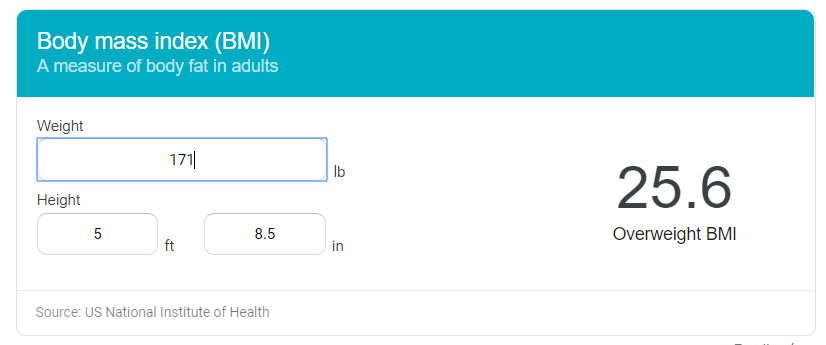

.. weight_loss documentation master file, created by
   sphinx-quickstart on Mon Jun 10 09:40:40 2019.
   You can adapt this file completely to your liking, but it should at least
   contain the root `toctree` directive.

====================================================================
Weight loss diary
====================================================================

.. toctree::
   :maxdepth: 1
   :glob:

   *

Aims
^^^^

I was 60kg at the beginning of college time. As I was a Junior, my weight was still around 61kg. Since I started my internship at the 4th year, my weight increased to 65kg. And it was quite stable since I got a baby girl in 2016. After that, my weight increased to 160 lbs.  I got a good job in Jan 2019. Today is June 2019. My weight has increased to 171 lbs. 

My aim to lose weight is just trying to gain more power during badminton. I could play up to 6 singles without feeling 'drained'.  Right now, actually since 2017, I can't even play powerful in a whole game (e.g., 3 matches).

So unlike people who really need to lose weight to stay away from certain diseases, I want to lose weight for better sports performance.

	

